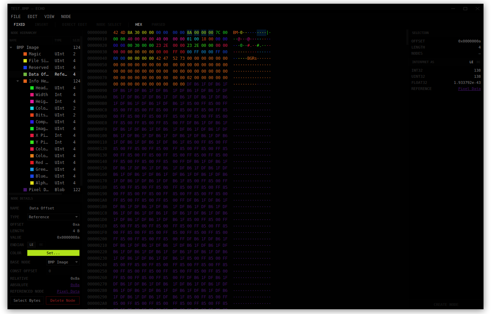

# Echo

A modern portable hex editor written in C++ and Qt6.

## Overview

Echo follows the standard Hex Editor layout and workflow, with a central Hex and ASCII view and a side panel to inspect and interpret bytes as different types. In addition, it includes a tree-based document model system comprised of groups of bytes called "nodes", each with a specified name and type. Once a node model has been constructed (either manually or using a parser), a separate view can be used to explore and edit the file as a tree rather than an array of bytes.

The project is currently in its early stages and is evolving rapidly.



## Building

Make sure you have CMake and Qt6 installed.

```sh
cmake -B build && cmake --build build
./build/echohexedit
```

